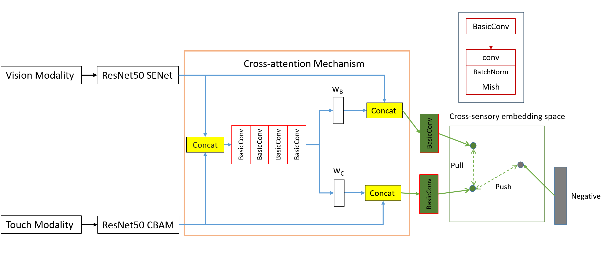

# Robot-Cross-Sensory-Retrieval-using-Deep-Neural-Network

# Related Code
| Model / Function | GitHub Link |
| :----- | :----- |
ResNet50 | https://github.com/WZMIAOMIAO/deep-learning-for-image-processing/tree/master
Squeeze-and-Excitation Networks| https://github.com/bubbliiiing/yolov4-tiny-pytorch

# Achievement
## The improvement in this project are in the following py files :
1. resnet_senet.py
2. resnet_cbam.py
3. crossnet.py

**_resnet_senet.py_** is a modification of the ResNet50 to added SENet attention mechanism to extract vision modality image feature

**_resnet_cbam.py_** is a modification of the ResNet50 to added CBAM attention mechanism to extract touch modality image feature

**_crossnet.py_** is this project introduced cross-sensory retrieval model, consists of three attention mechanisms CBAM in touch modality, SENet in vision modality and Cross attention mechanism.

# Performance
|  | CrossNet | Model 2 | Model 3 | Model 4 | Model 5 |
| :-----: | :-----: | :------: | :------: | :------: | :-----: |
| Attention Mechanism for Touch | CBAM | CBAM | SENet | SENet |  |
| Attention Mechanism for Vision | SENet | CBAM | CBAM | SENet |  |
| Cross attention Mechanism | CROSS | CROSS | CROSS | CROSS | CROSS |
| mAP | 0.6057 | 0.5620 | 0.5544 | 0.5463 | 0.5306 |

| Input | Retrieval | Chance | CCA[1] | Objectfolder[2] | CrossNet |
| :-----: | :------: | :------: | :------: | :-----: | :-----: |
| Vision | Touch | 0.05 | 0.24 | 0.50 | 0.61 |
| Touch | Vision | 0.05 | 0.29 | 0.48 | 0.60 |

# Environment
pip install -r ./requirements.txt

# Download
Download the test Dataset and Weight use following website:
https://drive.google.com/drive/folders/1atMpijxUOx7HMXiJF_KTiwTwoYBYSOtb?usp=sharing

After downloading please put it directly with other code files

# How to predict cross sensory retrieval
1. For touch modality retrieve vision modality, run prediction_touch.py
1. For vision modality retrieve touch modality, run prediction_vision.py

# Reference
[1] N. Rasiwasia, J. Costa Pereira, E. Coviello, G. Doyle, G. R. Lanckriet, R. Levy, and N. Vasconcelos, “A new approach to cross-modal multimedia retrieval,” in Proceedings of the 18th ACM international conference on Multimedia, pp. 251–260, 2010.

[2] R. Gao, Y.-Y. Chang, S. Mall, L. Fei-Fei, and J. Wu, “Objectfolder: A dataset of objects with implicit visual, auditory, and tactile representations,” in CoRL, 2021.

